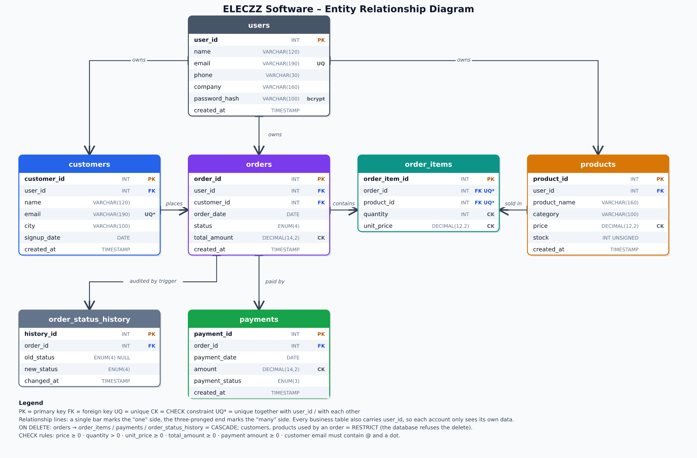
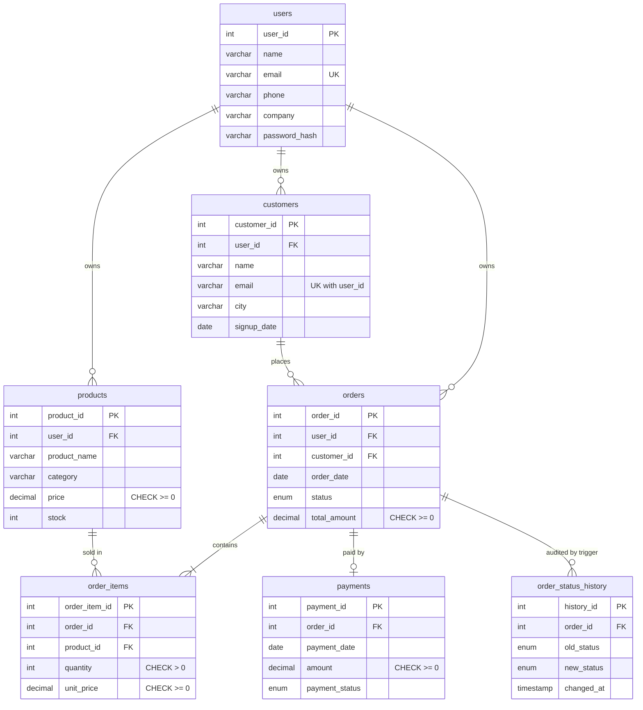

# Data Model / ER Diagram

*(High-resolution PNG: `er-diagram.png` · editable vector: `er-diagram.svg`. The Mermaid version
below is drawn automatically by GitHub.)*

## Relationships

| Parent (1) | Child (many) | Meaning | If the parent is deleted |
|---|---|---|---|
| `users` | `customers`, `products`, `orders` | an account owns its data | cascade |
| `customers` | `orders` | a customer places many orders | **restricted** – refused while orders exist |
| `orders` | `order_items` | an order has one or more lines | cascade |
| `products` | `order_items` | a product appears on many lines | **restricted** – refused while sold |
| `orders` | `payments` | an order is paid by a payment | cascade |
| `orders` | `order_status_history` | every status change is logged | cascade |

## Normalization

* **1NF** – every column holds one value; there are no repeating groups (order lines live in their own table).
* **2NF** – in `order_items` every non-key column (`quantity`, `unit_price`) depends on the whole key (order + product).
* **3NF** – customer details are stored once in `customers`, product details once in `products`; orders only
  reference them by ID.

Two deliberate, controlled exceptions, both required by the project brief:

* `orders.total_amount` repeats what could be summed from `order_items`. It is kept for fast reporting, calculated only
  by the server, and `sql/02_joins.sql` (check #6) proves it always equals the sum of the lines.
* `order_items.unit_price` repeats `products.price`. That is intentional: it records the price the customer really
  paid, so a later price change never rewrites past revenue.
